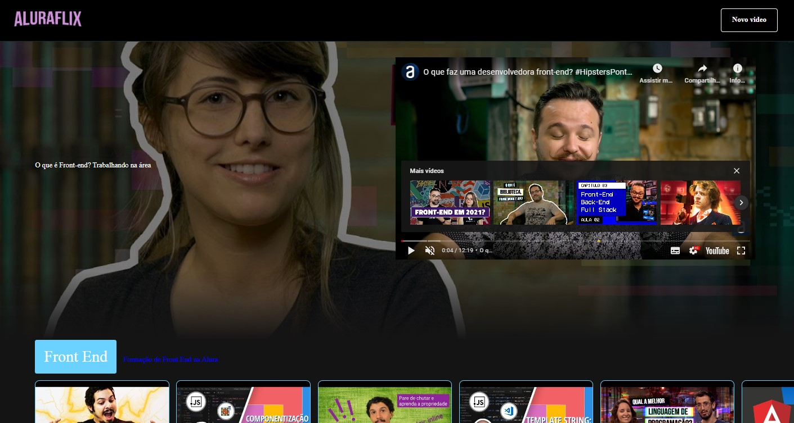
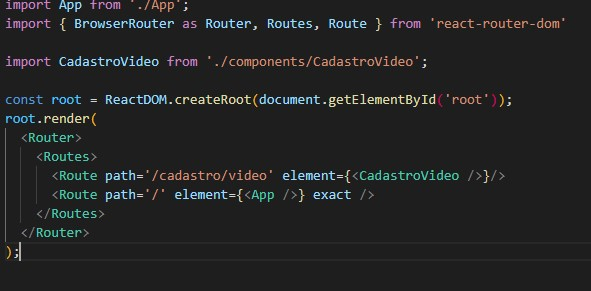

# Imersão ReactJs Alura 

  Em construção. Uma aplicação chamada Aluraflix. Utilizando ReactJS. Deploy no Vercel

 

[link para a apalicação](https://aluraflix-liard.vercel.app/)

[ ] Pacotes npx e npm  
[ ] Criação de components  
[ ] styled-components  
[ ] Deploy no Vercel  
[ ] npm install react-router-dom  
[ ] Utilização de rotas (router Dom - v6)  

  A partit da atualização do pacote do modulo react-router-dom. A partir da versão 6, não se tem mais suporte para <strong>Switch</strong>. Utiliza-se agora o <strong>Routes</strong>

